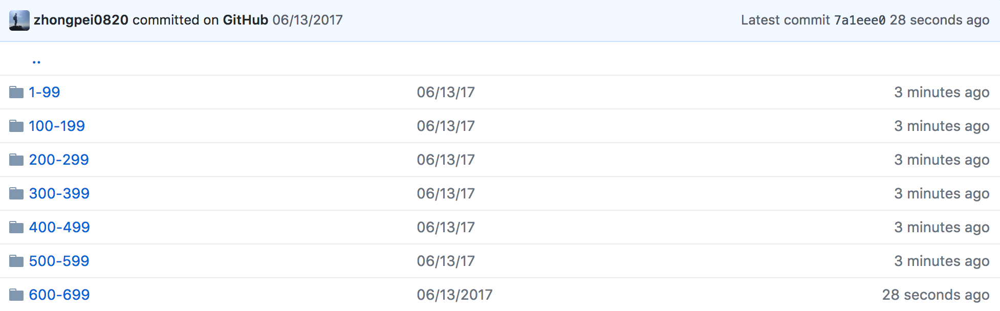

# My-Leetcode-helper-2.0
This program crawls your solutions from Leetcode, and commit them to your github repository.
Following is the user guide and program screenshots.


## Before using
This program is developed in Python 2.7.13, and tested under Python 2.7.13. So, make sure Python 2.7 is installed in your computer.

Install the following python modules by executing the following command:
```shell
pip install --upgrade -r requirements.txt
```
or
```shell
pip install requests
pip install lxml
pip install selenium
```

## User guide
#### 1. Set up the configuration in config.cfg. 
For example:
```
[leetcode]
username = wozuishuai
password = zuishuaidemima
languages = python,java,c,csharp
problems = 1,2,3,4,5

[github]
repo = /Users/wozuishuai/leetcode
```
Set your leetcode username and password under the [leetcode] section, they are used to login to your account and get your solution. Also, set the languages you use in leetcode, and problems you want to crawl from leetcode.

Set your github local repo for your leetcode solutions under the [github] section.

If you want to crawl all your solutions for all problems, just leave problems empty like this:
```
problems =
```
If languages is empty, the default language is python.

Problems and languages should be seperate by ',' **with no space in between**!

#### 2. After setting up the configuration file, execute the ```main.py```
Open your terminal, ```cd``` to My-Leetcode-hepler, then execute
```
python main.py
```
Now, the program should start to crawling your problems to your local repo.

<center></center>

After crawling the problems, this program will automatically commits all changes to your github. Your Leetcode repo should look like this:

Inside each folder:


## In the end

Happy Leetcoding! Feel free to use this program and tell me if you have any ideas for improving this program!

Cheers!


